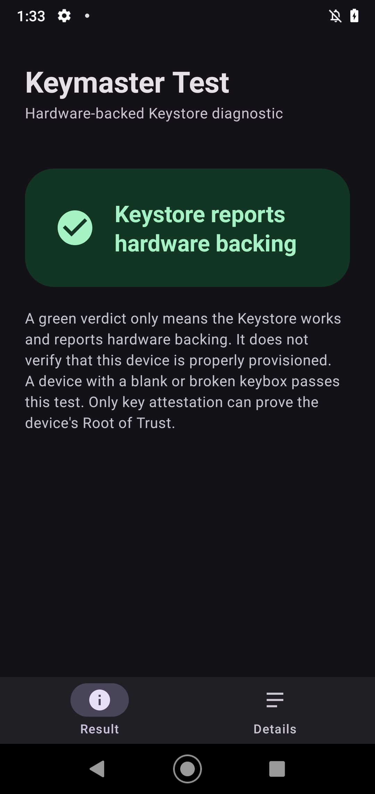
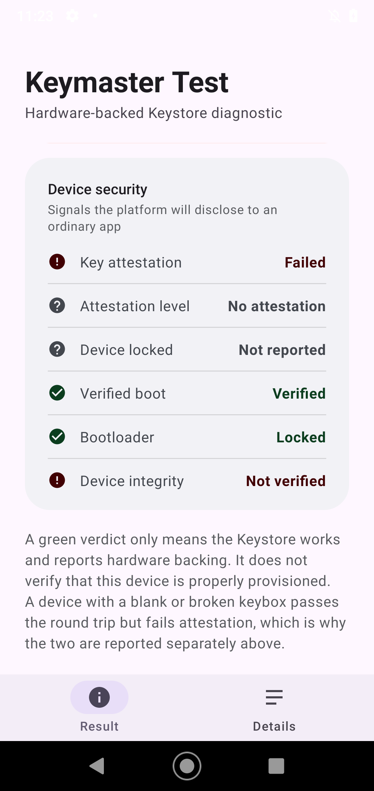
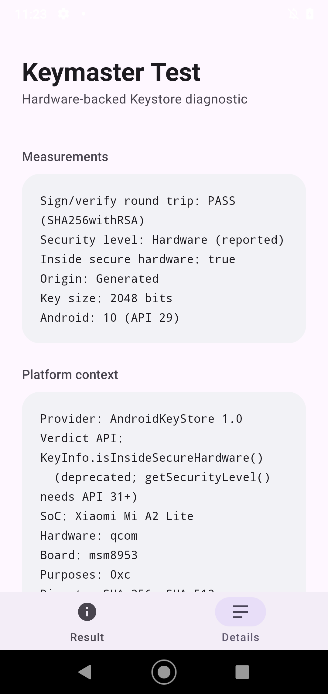

# Keymaster Hardware Test

A small Android diagnostic app for checking whether Android Keystore is using hardware-backed
secure storage.

The app generates an RSA 2048-bit key in `AndroidKeyStore`, signs and verifies a payload with
it, then reports a verdict. It then runs a **key attestation** probe and reports the device
security signals it can actually observe. The test keys are deleted when each probe finishes, so
no key material is left on the device. It requests no permissions, collects nothing, and sends
nothing anywhere.

| Result | Device security | Details |
| --- | --- | --- |
|  |  |  |

## Output

| Verdict | Meaning |
| --- | --- |
| `✅ KEYSTORE REPORTS HARDWARE BACKING` | Key generated, signed and verified; Android reports it as hardware-backed |
| `❌ KEYSTORE REPORTS SOFTWARE KEYS` | The same, but the key is not hardware-backed |
| `❌ KEYSTORE MALFUNCTIONING` | Key generated, but the sign/verify round trip failed |
| `❌ TEST FAILED` | The probe threw, for example no Keystore or a provider error |

Alongside the verdict it shows the sign/verify result, the key's security level (StrongBox,
Trusted Environment, or Software), whether the key reports as inside secure hardware, its
origin, and its size.

## Device security signals

The verdict above only tests the Keystore. The security card reports what the platform will
disclose to an ordinary app, and derives an overall assessment from it:

| Signal | Source | Healthy when |
| --- | --- | --- |
| Key attestation | A fresh key generated with a random 32-byte challenge; the returned chain is parsed and the challenge is verified | The chain is present and the challenge matches |
| Attestation level | The `attestationSecurityLevel` field of the attestation extension | Trusted Environment or StrongBox |
| Device locked | The `deviceLocked` tag of the attestation record | `true` |
| Verified boot | `ro.boot.verifiedbootstate` | `green` |
| Bootloader | `ro.boot.flash.locked`, then `ro.boot.vbmeta.device_state`, then `ro.build.tags` | Locked |
| Device integrity | Derived from the signals above | No signal failed |

A signal the platform refuses to disclose is reported as unavailable rather than guessed. The
overall assessment is one of *Signals are strong*, *Signals are incomplete*, *Problems found*,
or *Not enough information*.

The result card lists only short bullets. **Show full error** reveals the diagnosis and the raw
exception chain behind them.

### A worked example: a device that lies

On a Xiaomi Mi A2 Lite (`daisy_sprout`, Android 10) this app reports a green Keystore verdict,
a verified boot, and a locked bootloader, but attestation fails with
`KM_ERROR_KEYMASTER_NOT_CONFIGURED` (`-10003`). The device's TEE attestation keybox is missing or
invalid, so it cannot prove anything about its own keys. This is the exact situation a Keystore
round trip cannot detect and an attestation check can.

## What this does not prove

**A green verdict is not a security assessment.** It means the Keystore works and reports
hardware backing, not that the device is trustworthy.

- **Verified boot is a separate trust domain.** `ro.boot.verifiedbootstate=green` says nothing
  about Keymaster provisioning.
- **`isInsideSecureHardware()` is deprecated** as of Android 12 and can report `false` on builds
  that do have a Trusted Environment. Android 12+ uses `getSecurityLevel()`; older releases can
  produce a false negative.
- **Attestation failure is ambiguous.** It can mean an unprovisioned keybox, no screen lock, a
  vendor that does not support attestation, or a device that rejects `PURPOSE_ATTEST_KEY` and
  needs the signing-key fallback the app tries. The reported error distinguishes these.
- **Keymaster backing says nothing about FDE/FBE** (full-disk encryption).
- **System properties are read reflectively** and are restricted to greylisted apps, so a signal
  may read as unavailable on a device that would otherwise pass it.

## Why?

Useful when diagnosing a device where hardware-backed Keystore or Qualcomm Keymaster may be
malfunctioning. It distinguishes between:

- a Keystore that generates keys and signs correctly
- a software-backed Keystore
- a Keystore that generates keys but fails to sign
- a Keystore that cannot generate keys at all
- a Keystore that works but cannot attest its keys, which is a firmware fault rather than an
  app fault

## Requirements

- Android 6.0 (API 23) or newer. Key attestation requires Android 7.0 (API 24) and a secure
  screen lock; on older releases that signal reads as unavailable.
- No root required

## Building

See [COMPILING.md](COMPILING.md).

## License

MIT. See [LICENSE](LICENSE).
